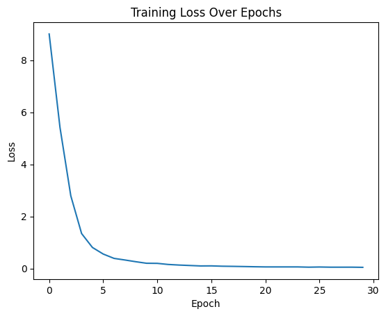

# LLM 만들기

- [LLM 바닥부터 만들기 (대형언어모델) 1시간 핵심 정리!](https://www.youtube.com/watch?v=osv2csoHVAo)
- [Build a Large Language Model (From Scratch)](https://www.manning.com/books/build-a-large-language-model-from-scratch) 

## 필요한 라이브러리 설치 및 로드


```python
# pip install transformers torch beautifulsoup4 requests
import re
import requests
from bs4 import BeautifulSoup
import torch
import torch.nn as nn
from torch.utils.data import Dataset, DataLoader
from transformers import AutoTokenizer, PreTrainedTokenizerFast
```

## 한글 웹페이지에서 텍스트 크롤링


```python
def fetch_korean_text(url):
    headers = {"User-Agent": "Mozilla/5.0"}
    res = requests.get(url, headers=headers)
    soup = BeautifulSoup(res.text, 'html.parser')
    texts = soup.get_text(separator=' ')
    return texts

import re

def clean_text(text):
    # 1. 줄바꿈 → 공백
    text = re.sub(r'\s+', ' ', text)
    
    # 2. 숫자 또는 한글 주석 번호 제거: [1], [주석 2]
    text = re.sub(r'\[(?:주석)?\s*\d+\]', '', text)

    # 3. 괄호 안의 출처나 주석 설명 제거 (선택적)
    text = re.sub(r'\(([^)]*출처[^)]*)\)', '', text)

    # 4. 파일/이미지/카테고리 관련 태그 제거
    text = re.sub(r'\[\[파일:[^\]]*\]\]', '', text)
    text = re.sub(r'\[\[분류:[^\]]*\]\]', '', text)

    # 5. 마크다운 링크나 위키 내부 링크 제거 (링크 텍스트만 남김)
    text = re.sub(r'\[\[(?:[^\]|]*\|)?([^\]]+)\]\]', r'\1', text)

    # 6. HTML 태그 제거
    text = re.sub(r'<[^>]+>', '', text)

    # 7. 위키 문법의 제목 처리 제거
    text = re.sub(r'={2,}[^=]+={2,}', '', text)

    # 8. 숫자 + 마침표 리스트 제거 (ex: 1. 문장)
    text = re.sub(r'\b\d+\.\s*', '', text)

    # 9. 앞뒤 공백으로 둘러싸인 숫자 제거 (ex: " 123 ", " 45 ")
    text = re.sub(r'(?<=\s)\d+(?=\s)', '', text)

    # 10. 여러 공백 반복 제거 및 앞뒤 공백 제거
    text = re.sub(r'\s+', ' ', text).strip()

    # 특수문자 중 불필요한 문자 제거 (필요 시 적용)
    text = re.sub(r'[※◆■●○▶▶◆◇♥♫♬]', '', text)

    # 줄임표(...)를 한 마침표로 치환
    text = re.sub(r'\.{2,}', '.', text)

    text = re.sub(r'위키백과|백과사전|둘러보기|메뉴|사이드바|숨기기|도움말|로그인|편집', '', text)

    return text


# 예시: 위키백과 인공지능 문서
url = "https://ko.wikipedia.org/wiki/인공지능"
raw_text = fetch_korean_text(url)
cleaned_text = clean_text(raw_text)
print("크롤링된 텍스트 샘플:\n", cleaned_text[:300])
```

    크롤링된 텍스트 샘플:
     인공지능 - , 우리 모두의  본문으로 이동 주  주  로 이동   대문 최근 바뀜 요즘 화제 임의의 문서로 사용자 모임 사랑방 사용자 모임 관리 요청  안내 소개  정책과 지침 질문방 검색 검색 보이기 기부 계정 만들기  개인 도구 기부 계정 만들기  목차 로 이동  처음 위치 강인공지능과 약인공지능 강인공지능과 약인공지능 하위섹션 토글하기 약인공지능 강인공지능 (AGI) 강인공지능의 실현 가능성에 관한 논쟁 역사 역사 하위섹션 토글하기 인공지능 이론의 발전 인공지능의 탄생(1943-1956) 인공두뇌학과 초기 신경 네트워크 튜링
    

## AutoTokenizer 로드 (한글 사전학습 모델)

| 모델명                                                                 | 특징 요약                                    |
| ------------------------------------------------------------------- | ---------------------------------------- |
| [`beomi/KcBERT-base`](https://huggingface.co/beomi/KcBERT-base)     | 웹/SNS용 한글에 특화된 토크나이저, 실사용 한글에 강함         |
| [`kykim/bert-kor-base`](https://huggingface.co/kykim/bert-kor-base) | 한국어 위키 기반 학습, 문어체/뉴스 등 일반 한글에 적합         |
| [`skt/kobert-base-v1`](https://huggingface.co/skt/kobert-base-v1)   | 형태소 기반 BERT, 매우 작은 사전 크기. Mecab 토크나이저 기반 |


```python
# tokenizer = AutoTokenizer.from_pretrained("klue/bert-base")

from transformers import AutoTokenizer, GPT2LMHeadModel

model_name = "skt/kogpt2-base-v2"

tokenizer = AutoTokenizer.from_pretrained(model_name)
model = GPT2LMHeadModel.from_pretrained(model_name)

tokenizer.pad_token = tokenizer.eos_token
model.resize_token_embeddings(len(tokenizer), mean_resizing=False)


text = "인공지능이란"
tokens = tokenizer.encode(text)
print("글자수:", len(text), "토큰수", len(tokens))
print(tokens)
print(tokenizer.decode(tokens))
for t in tokens:
    print(f"{t}\t -> {tokenizer.decode([t])}")
```

    글자수: 6 토큰수 4
    [13753, 8263, 7166, 10479]
    인공지능이란
    13753	 -> 인공
    8263	 -> 지
    7166	 -> 능
    10479	 -> 이란
    

## Dataset 클래스 정의


```python
class LanguageDataset(Dataset):
    def __init__(self, text, tokenizer, seq_len=32, stride = 1):
        self.tokenizer = tokenizer
        self.seq_len = seq_len
        token_ids = tokenizer.encode(text, add_special_tokens=True,
                                    max_length = 300, truncation=True)
        self.samples = [
            (
                token_ids[i:i + seq_len],
                token_ids[i + 1:i + seq_len + 1]
            )
            for i in range(0, len(token_ids) - seq_len, stride)
        ]

    def __len__(self):
        return len(self.samples)

    def __getitem__(self, idx):
        x, y = self.samples[idx]
        return torch.tensor(x), torch.tensor(y)
```

## Transformer 디코더 정의


```python
class MultiHeadAttention(nn.Module):
    def __init__(self, d_in, d_out):
        super().__init__()
        
        assert d_out % NUM_HEADS == 0, "d_out must be divisible by n_heads"

        self.d_out = d_out
        self.head_dim = d_out // NUM_HEADS

        self.W_query = nn.Linear(d_in, d_out, bias=QKV_BIAS)
        self.W_key = nn.Linear(d_in, d_out, bias=QKV_BIAS)
        self.W_value = nn.Linear(d_in, d_out, bias=QKV_BIAS)
        self.out_proj = nn.Linear(d_out, d_out)
        self.dropout = nn.Dropout(DROP_RATE)
        self.register_buffer('mask', torch.triu(torch.ones(CONTEXT_LENGTH, CONTEXT_LENGTH), diagonal=1))

    def forward(self, x):
        b, num_tokens, d_in = x.shape

        keys = self.W_key(x)  # (b, num_tokens, d_out)
        queries = self.W_query(x)
        values = self.W_value(x)

        keys = keys.view(b, num_tokens, NUM_HEADS, self.head_dim)
        values = values.view(b, num_tokens, NUM_HEADS, self.head_dim)
        queries = queries.view(b, num_tokens, NUM_HEADS, self.head_dim)

        keys = keys.transpose(1, 2)
        queries = queries.transpose(1, 2)
        values = values.transpose(1, 2)

        attn_scores = queries @ keys.transpose(2, 3)

        mask_bool = self.mask.bool()[:num_tokens, :num_tokens]

        attn_scores.masked_fill_(mask_bool, -torch.inf)

        attn_weights = torch.softmax(attn_scores / keys.shape[-1]**0.5, dim=-1)
        attn_weights = self.dropout(attn_weights)

        context_vec = (attn_weights @ values).transpose(1, 2)

        context_vec = context_vec.reshape(b, num_tokens, self.d_out)
        context_vec = self.out_proj(context_vec)

        return context_vec

class LayerNorm(nn.Module):
    def __init__(self, emb_dim):
        super().__init__()
        self.eps = 1e-5
        self.scale = nn.Parameter(torch.ones(emb_dim))
        self.shift = nn.Parameter(torch.zeros(emb_dim))

    def forward(self, x):
        mean = x.mean(dim=-1, keepdim=True)
        var = x.var(dim=-1, keepdim=True, unbiased=False)
        norm_x = (x - mean) / torch.sqrt(var + self.eps)
        return self.scale * norm_x + self.shift

class GELU(nn.Module):
    def __init__(self):
        super().__init__()

    def forward(self, x):
        return 0.5 * x * (1 + torch.tanh(
            torch.sqrt(torch.tensor(2.0 / torch.pi)) *
            (x + 0.044715 * torch.pow(x, 3))
        ))

class FeedForward(nn.Module):
    def __init__(self):
        super().__init__()
        self.layers = nn.Sequential(
            nn.Linear(EMB_DIM, 4 * EMB_DIM),
            GELU(),
            nn.Linear(4 * EMB_DIM, EMB_DIM),
        )

    def forward(self, x):
        return self.layers(x)

class TransformerBlock(nn.Module):
    def __init__(self):
        super().__init__()
        self.att = MultiHeadAttention(
            d_in=EMB_DIM,
            d_out=EMB_DIM)
    
        self.ff = FeedForward()
        self.norm1 = LayerNorm(EMB_DIM)
        self.norm2 = LayerNorm(EMB_DIM)
        self.drop_shortcut = nn.Dropout(DROP_RATE)

    def forward(self, x):
        shortcut = x
        x = self.norm1(x)
        x = self.att(x)
        x = self.drop_shortcut(x)
        x = x + shortcut

        shortcut = x
        x = self.norm2(x)
        x = self.ff(x)
        x = self.drop_shortcut(x)
        x = x + shortcut

        return x

class SimpleTransformer(nn.Module):
    def __init__(self):
        super().__init__()
        self.tok_emb = nn.Embedding(VOCAB_SIZE, EMB_DIM)
        self.pos_emb = nn.Embedding(CONTEXT_LENGTH, EMB_DIM)
        self.drop_emb = nn.Dropout(DROP_RATE)

        self.trf_blocks = nn.Sequential(
            *[TransformerBlock() for _ in range(NUM_LAYERS)])

        self.final_norm = LayerNorm(EMB_DIM)
        self.out_head = nn.Linear(EMB_DIM, VOCAB_SIZE, bias=False)

    def forward(self, in_idx):
        batch_size, seq_len = in_idx.shape
        tok_embeds = self.tok_emb(in_idx)
        pos_embeds = self.pos_emb(torch.arange(seq_len, device=in_idx.device))
        x = tok_embeds + pos_embeds  # Shape [batch_size, num_tokens, emb_size]
        x = self.drop_emb(x)
        x = self.trf_blocks(x)
        x = self.final_norm(x)
        logits = self.out_head(x)
        return logits
```

## 데이터 준비 및 모델 학습


```python
SEQ_LEN = 32
STRIDE = 1
BATCH_SIZE = 128

dataset = LanguageDataset(cleaned_text, tokenizer, seq_len=SEQ_LEN, stride = STRIDE)
loader = DataLoader(dataset, batch_size=BATCH_SIZE, shuffle=True)

VOCAB_SIZE = tokenizer.vocab_size
CONTEXT_LENGTH = 4096  # Shortened context length (orig: 1024)
EMB_DIM = 768  # Embedding dimension
NUM_HEADS = 12  # Number of attention heads
NUM_LAYERS = 16  # Number of layers
DROP_RATE = 0.1  # Dropout rate
QKV_BIAS = True  # Query-key-value bias

model = SimpleTransformer()
optimizer = torch.optim.Adam(model.parameters(), lr=1e-4)
criterion = nn.CrossEntropyLoss()
```


```python
dataiter = iter(loader)

x, y = next(dataiter)

print(tokenizer.decode(x[0].tolist()))
print(tokenizer.decode(y[0].tolist()))
```

    강인공지능 (AGI) 강인공지능의 실현 가능성에 관한 논쟁 역사 역사 하위섹션 토글하기 인공지능 이론의 발전
    공지능 (AGI) 강인공지능의 실현 가능성에 관한 논쟁 역사 역사 하위섹션 토글하기 인공지능 이론의 발전 인공
    

## 학습 루프


```python
# device = torch.device("cuda" if torch.cuda.is_available() else "cpu")
device = "cpu"
print(device)

torch.manual_seed(123)
optimizer = torch.optim.AdamW(model.parameters(), lr=0.0004, weight_decay=0.1)
```

    cpu
    


```python
tokens_seen, global_step = 0, -1
losses = []
epochs = 30

for epoch in range(epochs):
    model.train()  # Set model to training mode
    
    epoch_loss = 0
    for input_batch, target_batch in loader:
        optimizer.zero_grad() # Reset loss gradients from previous batch iteration
        input_batch, target_batch = input_batch.to(device), target_batch.to(device)

        logits = model(input_batch)
        loss = torch.nn.functional.cross_entropy(logits.flatten(0, 1), target_batch.flatten())
        epoch_loss += loss.item()
        loss.backward() # Calculate loss gradients
        optimizer.step() # Update model weights using loss gradients
        tokens_seen += input_batch.numel()
        global_step += 1

        if global_step % 1000 == 0:
            print(f"Tokens seen: {tokens_seen}")
        # Optional evaluation step

    avg_loss = epoch_loss / len(loader)
    losses.append(avg_loss)
    print(f"Epoch: {epoch + 1}, Loss: {avg_loss}")

    import os
    save_dir = './Result01'
    save_file = "model_" + str(epoch + 1).zfill(3) + ".pth"
    full_path = os.path.join(save_dir, save_file)
    os.makedirs(save_dir, exist_ok =True)
    torch.save(model.state_dict(), full_path)
```

    Tokens seen: 4096
    Epoch: 1, Loss: 9.004397869110107
    Epoch: 2, Loss: 5.416661103566487
    Epoch: 3, Loss: 2.790762782096863
    Epoch: 4, Loss: 1.3418810566266377
    Epoch: 5, Loss: 0.8087779680887858
    Epoch: 6, Loss: 0.5555466115474701
    Epoch: 7, Loss: 0.38891884684562683
    Epoch: 8, Loss: 0.3276205857594808
    Epoch: 9, Loss: 0.261806125442187
    Epoch: 10, Loss: 0.20233580470085144
    Epoch: 11, Loss: 0.1982583204905192
    Epoch: 12, Loss: 0.15628182888031006
    Epoch: 13, Loss: 0.13344949732224146
    Epoch: 14, Loss: 0.11638836810986201
    Epoch: 15, Loss: 0.09889435023069382
    Epoch: 16, Loss: 0.10149468729893367
    Epoch: 17, Loss: 0.08859376609325409
    Epoch: 18, Loss: 0.08307729164759318
    Epoch: 19, Loss: 0.07603772232929866
    Epoch: 20, Loss: 0.0679690216978391
    Epoch: 21, Loss: 0.06175084908803304
    Epoch: 22, Loss: 0.061623793095350266
    Epoch: 23, Loss: 0.061789541194836296
    Epoch: 24, Loss: 0.061669417967398964
    Epoch: 25, Loss: 0.051754837234814964
    Epoch: 26, Loss: 0.058371646950642266
    Epoch: 27, Loss: 0.051499027758836746
    Epoch: 28, Loss: 0.05151362096269926
    Epoch: 29, Loss: 0.05191434298952421
    Epoch: 30, Loss: 0.04576656098167101
    


```python
import matplotlib.pyplot as plt

plt.plot(losses)
plt.xlabel('Epoch')
plt.ylabel('Loss')
plt.title('Training Loss Over Epochs')
plt.show()
```


    

    


```python
# 파일로 저장했던 네트워크의 가중치들 읽어들이기
save_dir = './Result01'
save_file = "model_030.pth"
full_path = os.path.join(save_dir, save_file)
model.load_state_dict(torch.load(full_path, map_location=device, weights_only=True))
model.eval() # dropout을 사용하지 않음
```


    SimpleTransformer(
      (tok_emb): Embedding(51200, 768)
      (pos_emb): Embedding(4096, 768)
      (drop_emb): Dropout(p=0.1, inplace=False)
      (trf_blocks): Sequential(
        (0): TransformerBlock(
          (att): MultiHeadAttention(
            (W_query): Linear(in_features=768, out_features=768, bias=True)
            (W_key): Linear(in_features=768, out_features=768, bias=True)
            (W_value): Linear(in_features=768, out_features=768, bias=True)
            (out_proj): Linear(in_features=768, out_features=768, bias=True)
            (dropout): Dropout(p=0.1, inplace=False)
          )
          (ff): FeedForward(
            (layers): Sequential(
              (0): Linear(in_features=768, out_features=3072, bias=True)
              (1): GELU()
              (2): Linear(in_features=3072, out_features=768, bias=True)
            )
          )
          (norm1): LayerNorm()
          (norm2): LayerNorm()
          (drop_shortcut): Dropout(p=0.1, inplace=False)
        )


```python
idx = tokenizer.encode("인공지능") # 토큰 id의 list
idx = torch.tensor(idx).unsqueeze(0).to(device)

with torch.no_grad():
    logits = model(idx)

logits = logits[:, -1, :]

# 가장 확률이 높은 단어 10개 출력
top_logits, top_indices = torch.topk(logits, 10) 
for p, i in zip(top_logits.squeeze(0).tolist(), top_indices.squeeze(0).tolist()):
    print(f"{p:.2f}\t {i}\t {tokenizer.decode([i])}")

# 가장 확률이 높은 단어 출력
idx_next = torch.argmax(logits, dim=-1, keepdim=True)
flat = idx_next.squeeze(0) # 배치 차원 제거 torch.Size([1])
out = tokenizer.decode(flat.tolist()) # 텐서를 리스트로 바꿔서 디코드
print(out)
```

    11.55	 33622	 이론의
    10.60	 8143	 의
    10.17	 9571	 -
    9.94	 10692	 상징
    8.56	 9440	 (
    8.21	 19773	 하위
    7.60	 6903	 과
    7.25	 32290	 강인
    5.49	 384	 )
    4.40	 7676	 붐
    이론의
    


```python
def generate(model, idx, max_new_tokens, context_size, temperature=0.0, top_k=None, eos_id=None):

    for _ in range(max_new_tokens):
        idx_cond = idx[:, -context_size:]
        with torch.no_grad():
            logits = model(idx_cond)
        logits = logits[:, -1, :]

        if top_k is not None:
            top_logits, _ = torch.topk(logits, top_k)
            min_val = top_logits[:, -1]
            logits = torch.where(logits < min_val, torch.tensor(float("-inf")).to(logits.device), logits)

        if temperature > 0.0:
            logits = logits / temperature
            probs = torch.softmax(logits, dim=-1)  # (batch_size, context_len)
            idx_next = torch.multinomial(probs, num_samples=1)  # (batch_size, 1)
        else:
            idx_next = torch.argmax(logits, dim=-1, keepdim=True)  # (batch_size, 1)

        if idx_next == eos_id:
            break

        idx = torch.cat((idx, idx_next), dim=1)  # (batch_size, num_tokens+1)

    return idx
```


```python
start_context = input("Start context: ")

# idx = tokenizer.encode(start_context, allowed_special={'<|endoftext|>'})
idx = tokenizer.encode(start_context)
idx = torch.tensor(idx).unsqueeze(0)

context_size = model.pos_emb.weight.shape[0] 

for i in range(5):

    token_ids = generate(
        model=model,
        idx=idx.to(device),
        max_new_tokens=50,
        context_size= context_size,
        top_k=50,
        temperature=0.5
    )

    flat = token_ids.squeeze(0) # remove batch dimension
    out = tokenizer.decode(flat.tolist()).replace("\n", " ")

    print(i+1, ":", out)
```

    Start context:  인공지능이란
    1 : 인공지능이란) 인공지능 이론의 발전 인공지능의 탄생(1943-1956) 인공두뇌학과 초기 신경 네트워크 튜링 테스트 게임 인공지능 상징 추론과 논리 이론 다트머스 컨퍼런스 1956년: AI의 탄생(19
    2 : 인공지능이란) 강인공지능의 실현 가능성에 관한 논쟁 역사 역사 하위섹션 토글하기 인공지능 이론의 발전 인공지능의 탄생(1943-1956) 인공지능의 탄생(1943-1956) 인공두뇌학과
    3 : 인공지능이란) 강인공지능의 실현 가능성에 관한 논쟁 역사 역사 하위섹션 토글하기 인공지능 이론의 발전 인공지능의 탄생(1943-1956) 인공지능의 탄생(1943-1956) 인공지능의
    4 : 인공지능이란) 강인공지능의 실현 가능성에 관한 논쟁 역사 역사 하위섹션 토글하기 인공지능 이론의 발전 인공지능의 탄생(1943-1956) 인공지능의 탄생(1943-1956) 인공지능의
    5 : 인공지능이란) 인공지능 이론의 발전 인공지능의 탄생(1943-1956) 인공두뇌학과 초기 신경 네트워크 튜링 테스트 게임 인공지능 상징 추론과 논리 이론 다트머스 컨퍼런스 1956년: AI의 탄생 황금
