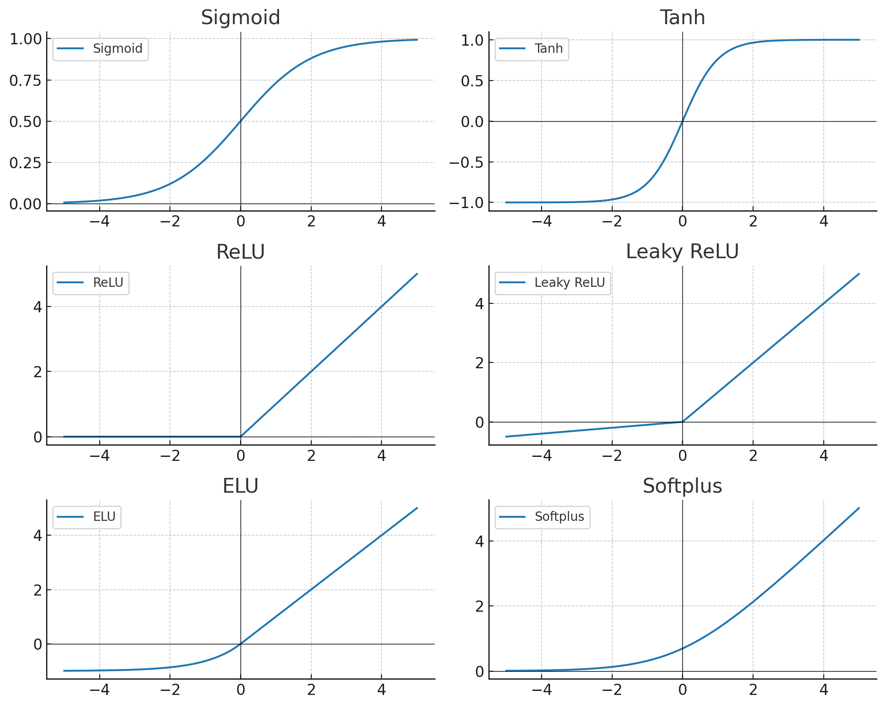

# 신경망 모델 구현

- 소스: [뉴럴네트워크로 곡선 맞추기](https://github.com/HongLabInc/HongLabAI/blob/main/Part1/Ch3/0303_NonlinearFitting.ipynb)

## 라이브러리 로드


```python
import torch
import torch.nn as nn
import torch.optim as optim
from torch.utils.data import Dataset, DataLoader
import matplotlib.pyplot as plt
import numpy as np
import torchviz
```

## 데이터셋 준비


```python
torch.manual_seed(2)
np.random.seed(2)
```


```python
# if torch.cuda.is_available():
#     device = 'cuda'
# else:
#     device = 'cpu'
device = 'cpu'
print(f"Using device: {device}")
```


```python
class RegressionDataset(Dataset):
    def __init__(self, x_data, y_data):
        self.x_data = x_data
        self.y_data = y_data
        self.n_samples = x_data.shape[0]
    def __len__(self):
        return self.n_samples
    def __getitem__(self, index):
        return self.x_data[index], self.y_data[index]
```


```python
import altair as alt
import pandas as pd
import kagglehub
path = kagglehub.dataset_download("jayhingrajiya/auto-mpg-dataset-miles-per-gallon")
data = pd.read_csv(path + "/auto.csv")
data['horsepower'] = pd.to_numeric(data['horsepower'], errors='coerce')
data = data.dropna(subset=['horsepower', 'mpg'])  # Add this line

alt.Chart(data).mark_point().encode(
    # x=alt.X('weight', title='weight'),
    x=alt.X('horsepower', title='horsepower'),
    y=alt.Y('mpg', title='mpg'),
    color='origin',
    tooltip=['horsepower', 'mpg']
).interactive()  # Enables zooming and panning

x_numpy = data['horsepower'].values.astype(np.float32)
y_numpy = data['mpg'].values.astype(np.float32)
```

## 데이터 전처리


```python
# Normalize data
x_numpy = (x_numpy - x_numpy.mean()) / x_numpy.std()
y_numpy = (y_numpy - y_numpy.mean()) / y_numpy.std()
```

## 데이터 분할

### 훈련, 검증, 시험 데이터 분할


```python
# Split indices (70% train, 15% val, 15% test)
n_samples = len(x_numpy)
indices = np.random.permutation(n_samples)

train_size = int(0.7 * n_samples)
val_size = int(0.15 * n_samples)

train_indices = indices[:train_size]
val_indices = indices[train_size:train_size+val_size]
test_indices = indices[train_size+val_size:]
```

### tensor 변환


```python
# Create tensors for each split
x_train = torch.from_numpy(x_numpy[train_indices]).unsqueeze(1).to(device)
y_train = torch.from_numpy(y_numpy[train_indices]).unsqueeze(1).to(device)

x_val = torch.from_numpy(x_numpy[val_indices]).unsqueeze(1).to(device)
y_val = torch.from_numpy(y_numpy[val_indices]).unsqueeze(1).to(device)

x_test = torch.from_numpy(x_numpy[test_indices]).unsqueeze(1).to(device)
y_test = torch.from_numpy(y_numpy[test_indices]).unsqueeze(1).to(device)

# Create datasets
train_dataset = RegressionDataset(x_train, y_train)
val_dataset = RegressionDataset(x_val, y_val)
test_dataset = RegressionDataset(x_test, y_test)

# Create dataloaders
#batch_size = 32
batch_size = len(train_dataset)
train_loader = DataLoader(train_dataset, batch_size=batch_size, shuffle=True)
val_loader = DataLoader(val_dataset, batch_size=len(val_dataset))
test_loader = DataLoader(test_dataset, batch_size=len(test_dataset))
```

## 학습 정의


```python
def train(model, num_epochs=10000):
    optimizer = optim.Adam(model.parameters(), lr=0.0001)
    criterion = nn.MSELoss()
    train_losses = []
    val_losses = []

    for epoch in range(num_epochs):
        # Train
        model.train()
        train_loss = 0.0
        for x_inputs, y_targets in train_loader:
            y_pred = model(x_inputs)
            loss = criterion(y_pred, y_targets)
            train_loss += loss.item() * len(x_inputs)

            optimizer.zero_grad()
            loss.backward()
            optimizer.step()

        train_loss /= len(train_dataset)
        train_losses.append(train_loss)

        # Validation
        model.eval()
        with torch.no_grad():
            val_loss = 0.0
            for x_inputs, y_targets in val_loader:
                y_pred = model(x_inputs)
                loss = criterion(y_pred, y_targets)
                val_loss += loss.item() * len(x_inputs)

            val_loss /= len(val_dataset)
            val_losses.append(val_loss)

        # if (epoch + 1) % (num_epochs // 10) == 0:
        #     print(f'Epoch {epoch+1}: Train Loss = {train_loss:.4f}, Val Loss = {val_loss:.4f}')

    # torch.save(model.state_dict(), 'my_model.pth')
    # model.load_state_dict(torch.load('my_model.pth'))
    model.eval()

    # Calculate final losses
    with torch.no_grad():
        test_loss = 0.0
        for x_inputs, y_targets in test_loader:
            y_pred = model(x_inputs)
            loss = criterion(y_pred, y_targets)
            test_loss += loss.item() * len(x_inputs)
        test_loss /= len(test_dataset)

    print(f'Final Test Loss: {test_loss:.4f}')

    train_losses = train_losses[20:]  # Loss가 너무 높은 앞부분 삭제
    val_losses = val_losses[20:]

    # Plot training curves and predictions
    plt.figure(figsize=(15, 5))

    # Loss curves
    plt.subplot(1, 3, 1)
    plt.plot(train_losses, label='Train')
    plt.plot(val_losses, label='Validation')
    plt.title('Loss vs Epochs')
    plt.xlabel('Epochs')
    plt.ylabel('Loss (MSE)')
    plt.legend()
    plt.grid(True)

    # Training data and predictions
    plt.subplot(1, 3, 2)
    plt.scatter(x_train.cpu().numpy(), y_train.cpu().numpy(), color='blue', alpha=0.5, label='Train')
    plt.scatter(x_val.cpu().numpy(), y_val.cpu().numpy(), color='red', alpha=0.5, label='Val')
    plt.scatter(x_test.cpu().numpy(), y_test.cpu().numpy(), color='yellow', alpha=0.5, label='Test')

    # Model predictions
    x_line = torch.linspace(torch.min(x_train), torch.max(x_train), 100).unsqueeze(1).to(device)
    y_line = model(x_line).detach().cpu().numpy()
    plt.plot(x_line.cpu().numpy(), y_line, color='black', label='Model')

    plt.title('Predictions vs Data')
    plt.xlabel('Normalized Horsepower')
    plt.ylabel('Normalized MPG')
    plt.legend()
    plt.grid(True)

    plt.tight_layout()
    plt.show()
```

## 모델 정의 및 학습

### 3차 다항식


```python
class SimpleModel(nn.Module):
    def __init__(self):
        super().__init__()
        # Directly define parameters for y = a*x^2 + b*x + c
        self.a = nn.Parameter(torch.randn(1))
        self.b = nn.Parameter(torch.randn(1))
        self.c = nn.Parameter(torch.randn(1))
        self.d = nn.Parameter(torch.randn(1))

    def forward(self, x):
        return self.a * x**3 + self.b * x**2 + self.c * x + self.d

train(SimpleModel().to(device))
```

### 1차 다항식 (Linear)


```python
class SimpleModel(nn.Module):
    def __init__(self):
        super().__init__()

        self.layers = nn.ModuleList()
        self.layers.append(nn.Linear(in_features=1, out_features=1, bias=True))

    def forward(self, x):
        for l in self.layers:
            x = l(x)
        return x

train(SimpleModel().to(device), num_epochs=20000) # epoch 두 배
```

### 은닉층 노드 4개

- 초기값에 따라 다른 결과


```python
class SimpleModel(nn.Module):
    def __init__(self):
        super().__init__()

        self.layers = nn.ModuleList()
        self.layers.append(nn.Linear(in_features=1, out_features=4, bias=True))
        self.layers.append(nn.GELU())
        self.layers.append(nn.Linear(in_features=4, out_features=1, bias=True))

    def forward(self, x):
        for l in self.layers:
            x = l(x)
        return x

train(SimpleModel().to(device))
```

### 은닉층 노드 128개


```python
class SimpleModel(nn.Module):
    def __init__(self):
        super().__init__()

        self.layers = nn.ModuleList()
        self.layers.append(nn.Linear(in_features=1, out_features=128, bias=True))
        self.layers.append(nn.ReLU())
        self.layers.append(nn.Linear(in_features=128, out_features=1, bias=True))

    def forward(self, x):
        for l in self.layers:
            x = l(x)
        return x

train(SimpleModel().to(device))
```

### 은닉층 노드 512개

- 과적합, [Overfitting](https://en.wikipedia.org/wiki/Overfitting)


```python
class SimpleModel(nn.Module):
    def __init__(self):
        super().__init__()

        self.layers = nn.ModuleList()
        self.layers.append(nn.Linear(in_features=1, out_features=512, bias=True))
        self.layers.append(nn.ReLU())
        self.layers.append(nn.Linear(in_features=512, out_features=1, bias=True))

    def forward(self, x):
        for l in self.layers:
            x = l(x)
        return x

train(SimpleModel().to(device))
```

### 활성화 함수

| 함수                                    | 특징                 | 장점               | 단점                         | 대표 사용처       |
| ------------------------------------- | ------------------ | ---------------- | -------------------------- | ------------ |
| **Sigmoid** (`torch.sigmoid`)         | 입력을 (0,1)로 매핑      | 확률 해석 용이         | 기울기 소실(Vanishing Gradient) | 이진 분류 출력층    |
| **Tanh** (`torch.tanh`)               | 입력을 (-1,1)로 매핑     | 데이터 중심(0)에 맞춤    | 기울기 소실                     | 순환신경망(RNN)   |
| **ReLU** (`torch.relu`)               | 0 이하 → 0, 양수 → 그대로 | 연산 간단, 기울기 소실 완화 | Dead Neuron 문제             | CNN, MLP 은닉층 |
| **Leaky ReLU** (`torch.nn.LeakyReLU`) | 음수에 작은 기울기 부여      | Dead Neuron 방지   | 하이퍼파라미터(기울기) 필요            | CNN, MLP 은닉층 |
| **ELU** (`torch.nn.ELU`)              | 음수에서도 부드럽게 변환      | ReLU의 단점 보완      | 계산량 증가                     | 심층 네트워크      |
| **Softmax** (`torch.nn.Softmax`)      | 각 클래스 확률로 변환       | 멀티 클래스 확률 해석     | 크로스엔트로피와 함께 사용 필수          | 다중 분류 출력층    |
| **Softplus** (`torch.nn.Softplus`)    | ReLU의 부드러운 버전      | 미분 가능            | 계산량 증가                     | 특수 상황        |




```python
class SimpleModel(nn.Module):
    def __init__(self):
        super().__init__()

        self.layers = nn.ModuleList()
        self.layers.append(nn.Linear(in_features=1, out_features=128, bias=True))
        self.layers.append(nn.Sigmoid())
        self.layers.append(nn.Linear(in_features=128, out_features=1, bias=True))

    def forward(self, x):
        for l in self.layers:
            x = l(x)
        return x

train(SimpleModel().to(device))
```
